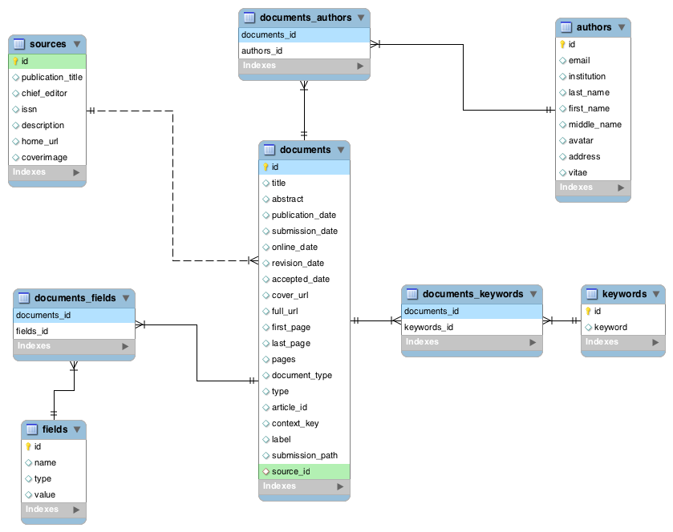

Database Schema
***************

Paper Database
==============

.. author: Floyd

Introduction
------------

The Paper Database comes from ``fintime50``, a scrapy
spider project with the aims of scraping basic information of papers,
authors, keywords from the journals of Finance Time 50.

FMR uses the fintime50’s database as the raw data to train the LDA
model， and, by the trained model, recommend the reviewers for user’s
paper.

Data Schema
-----------

ER Diagram
~~~~~~~~~~

sources
~~~~~~~

This table represents entities such as journals, conferences and other
sources from where papers come.

1. In the table, ``publication_title`` is for journal or conference
   name.

2. ``coverimage`` is for the journal’s cover image. ``home_url`` is the
   home web page url for the source.

3. ``chief_editor``, ``issn`` and ``description`` are also included in
   this table.

documents
~~~~~~~~~

This table consists of three parts.

1. Basic information for the papers, such as ``title``, ``abstract``,
   ``first_page``, ``last_page``, ``pages``, ``submission_path``.

``submission_path`` indicates which year, which volume and which issue
papers come from.

2. Date and time about this paper, including ``publication_date``,
   ``submission_date``, ``online_date``, ``revision_date``,
   ``accepted_date``.

3. Index Information, such as ``full_url``, ``cover_url``,
   ``article_id``, ``context_key``.

This is a one-to-many relationship between ``sources`` and
``documents``. The attribute ``sources_id`` in table ``documents``
represents this relationship.

authors
~~~~~~~

This table consists of two parts.

1. Authors’ profiles, which include ``last_name``, ``middle_name``,
   ``first_name``, ``avatar``.

2. Authors’ information, which includes ``vitae``, ``email``,
   ``address``, ``institution``.

There is a many-to-many relationship between ``documents`` and
``authors``. In the database, the register table ``documents_authors``
represents this relationship.

keywords
~~~~~~~~

This table only contains ``keyword`` itself.

There is a many-to-many relationship between ``documents`` and
``keywords``. In the database, the register table ``documents_keywords``
represents this relationship.

Note about Web App Database
===========================

In this application, the database for the web app are seperated from paper-author databases. In most cases, you should not care about the web app database.

There is only one table in web app database, namely
``RecommendationResult``, which contains the users’ forms and
recommendation results.